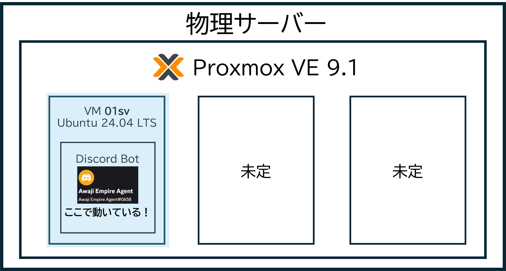

# ⚙️ Awaji Empire Agent - 全体構成アーキテクチャ

## 1. 概要
本プロジェクトは、淡路帝国のサーバー管理を自動化し、ユーザー体験を向上させるための統合プラットフォームです。物理サーバー(Proxmox)からエッジネットワーク(Cloudflare)までを一貫して自前で構築しています。

## 2. システム構成図
物理レイヤーから外部サービス連携までの全体像を示します。

## 3. インフラストラクチャ詳細

### 3.1 物理サーバー (Node) スペック
本システムの基盤となる物理マシンの構成です。

| コンポーネント | スペック | 備考 |
| :--- | :--- | :--- |
| **CPU** | Intel Core i3 9100F | 4コア/4スレッド。VM・CTの並列稼働を支える心臓部。 |
| **GPU** | NVIDIA GeForce GT 710 | **望まれざる客。** 映像出力用。 |
| **RAM** | 16GB | Proxmox上での複数サービス稼働に余裕を持たせた容量。 |
| **SSD** | 500GB | 高速なディスクI/Oにより、DBアクセスを高速化。 |

### 3.2 仮想化・ネットワーク
- **Hypervisor**: Proxmox VE 9.1 上で Ubuntu 24.04 LTS (VM) と MariaDB (CT) を稼働。
- **Network**: Cloudflare Tunnel を使用し、自宅回線のIPを公開せずに `dashboard.awajiempire.net` を運用。
- **Database**: MariaDB を中央ハブとし、BotとWebアプリ間でリアルタイムなデータ共有を実現。

## 4. 機能別ドキュメント
詳細なロジックは各ドキュメントを参照してください。
- [メッセージフィルタリング機能](./FEATURE_FILTER.md)
- [通知マスミュート機能](./FEATURE_MASS_MUTE.md)
- [内製アンケートシステム](./FEATURE_SURVEY.md)
