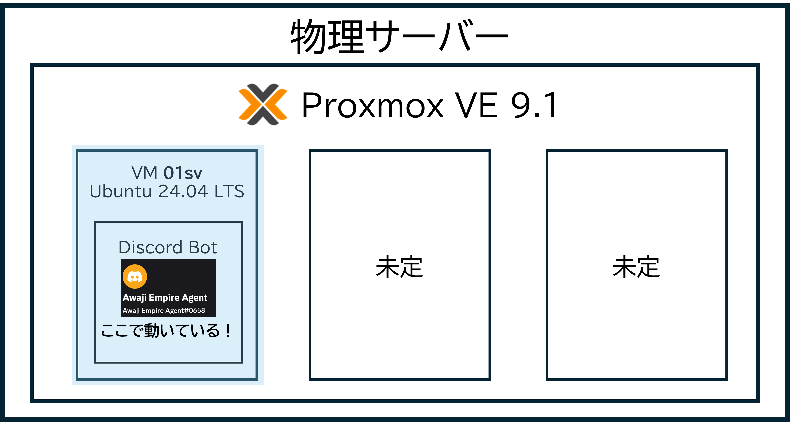
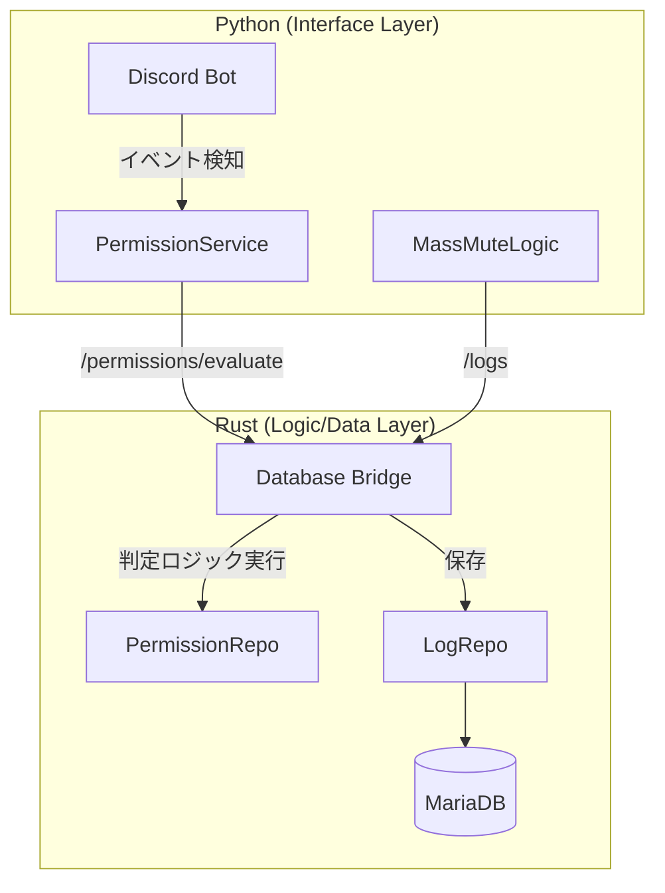

# ⚙️ Awaji Empire Agent - 全体構成アーキテクチャ

## 1. 概要

本プロジェクトは、淡路帝国のサーバー管理を自動化し、ユーザー体験を向上させるための統合プラットフォームです。物理サーバー(Proxmox)からエッジネットワーク(Cloudflare)までを一貫して自前で構築しています。

## 2. システム構成図

物理レイヤーから外部サービス連携までの全体像を示します。

## 3. インフラストラクチャ詳細

### 3.1 物理サーバー (Node) スペック

本システムの基盤となる物理マシンの構成です。

| コンポーネント | スペック | 備考 |
| :--- | :--- | :--- |
| **CPU** | Intel Core i3 9100F | 4コア/4スレッド。VM・CTの並列稼働を支える心臓部。 |
| **GPU** | NVIDIA GeForce GT 710 | **望まれざる客。** 映像出力用。 |
| **RAM** | 16GB | Proxmox上での複数サービス稼働に余裕を持たせた容量。 |
| **SSD** | 500GB | 高速なディスクI/Oにより、DBアクセスを高速化。 |

### 3.2 仮想化・ネットワーク

- **Hypervisor**: Proxmox VE 9.1 上で Ubuntu 24.04 LTS (VM) と MariaDB (CT) を稼働。
- **Network**: Cloudflare Tunnel を使用し、自宅回線のIPを公開せずに `dashboard.awajiempire.net` を運用。
- **Database**: MariaDB を中央ハブとし、BotとWebアプリ間でリアルタイムなデータ共有を実現。

## 4. 機能別ドキュメント

詳細なロジックは各ドキュメントを参照してください。

- [メッセージフィルタリング機能](./FEATURE_FILTER.md)
- [通知マスミュート機能](./FEATURE_MASS_MUTE.md)
- [内製アンケートシステム](./FEATURE_SURVEY.md)
- [寝落ち検知機能](./FEATURE_VOICE_KEEPER.md)

## 5. 開発方針と技術選定の原則 (Development Policy)

システムの堅牢性とメンテナンス性を維持するため、以下の役割分担を厳格に適用します。

### 5.1 言語別の役割分担 (Separation of Concerns)

| 役割 | 使用言語/技術 | 担当範囲 |
| :--- | :--- | :--- |
| **ユーザーインターフェース (UI)** | **Python (Quart / Jinja2)** | HTMLレンダリング、CSS、クライアントサイドJSの配信。 |
| **外部API連携 (Discord)** | **Python (discord.py)** | Discord APIとの直接通信、イベントリスナー、コマンド受付。 |
| **ビジネスロジック (Logic)** | **Rust (database_bridge)** | 権限判定、計算処理、データ変換。複雑な条件分岐の集約。 |
| **永続化層 (Persistence)** | **Rust (sqlx)** | DB(MariaDB)へのクエリ実行、コネクションプール管理。 |

```mermaid
graph TD
    subgraph "Python (Interface Layer)"
        discord[Discord Bot]
        ps[PermissionService]
        mm[MassMuteLogic]
    end

    subgraph "Rust (Logic/Data Layer)"
        bridge[Database Bridge]
        prepo[PermissionRepo]
        lrepo[LogRepo]
        db[(MariaDB)]
    end

    discord -- イベント検知 --> ps
    ps -- "/permissions/evaluate" --> bridge
    bridge -- 判定ロジック実行 --> prepo
    mm -- "/logs" --> bridge
    bridge -- 保存 --> lrepo
    lrepo --> db
```

### 5.2 設計の基本原則

1. **Python プロセスの軽量化**: Python 側には DB 接続ドライバ（aiomysql等）を持たせず、すべての永続化操作を Rust 製の「データベースブリッジ (IPC)」へ委譲します。
2. **型安全性の追求**: Rust 側の `sqlx` を活用し、コンパイル時にスキーマ整合性を検証します。これにより本番環境でのデコードエラーや型不一致を最小化します。
3. **OSトレンドへの適応**: Ubuntu 26.04 LTS のコアシステムにおける Rust 採用の流れを汲み、長期的な安定運用を見据えた技術スタックを選択します。
4. **責務の分離**: Python 側は「どう見せるか / どう受け付けるか」に集中し、Rust 側は「何が正しい状態か / どう保存するか」を決定します。

### 5.3 ネットワークとセキュリティ

- **プロセス間通信 (IPC)**: Python と Rust はローカルスタック（127.0.0.1）上の HTTP を介して通信します。将来的なマイクロサービス化を見据え、API は RESTful に設計します。
- **データ不揮発性**: すべての重要な状態操作は Rust 側でバリデーションされた後に DB へ書き込まれます。
