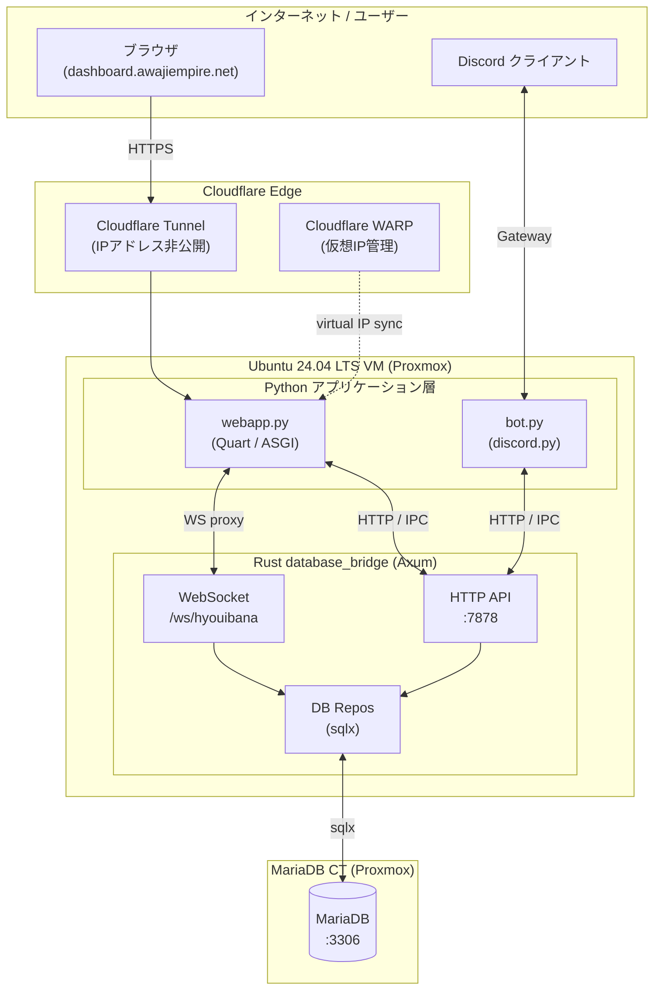
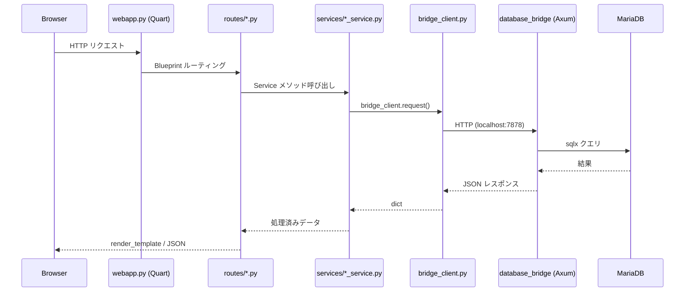

# Awaji Empire Agent - アーキテクチャ概要

## 1. 概要

本プロジェクトは、淡路帝国の Discord サーバー管理・イベント運営・対戦ロビーを統合する自作プラットフォームです。物理サーバー (Proxmox) からエッジネットワーク (Cloudflare) までを一貫して自前で構築しています。

---

## 2. システム全体構成


```mermaid
graph TD
    subgraph Internet["インターネット / ユーザー"]
        Browser["ブラウザ\n(dashboard.awajiempire.net)"]
        DiscordClient["Discord クライアント"]
    end

    subgraph Edge["Cloudflare Edge"]
        CFTunnel["Cloudflare Tunnel\n(IPアドレス非公開)"]
        WARP["Cloudflare WARP\n(仮想IP管理)"]
    end

    subgraph VM["Ubuntu 24.04 LTS VM (Proxmox)"]
        subgraph PythonApp["Python アプリケーション層"]
            WebApp["webapp.py\n(Quart / ASGI)"]
            Bot["bot.py\n(discord.py)"]
        end

        subgraph RustBridge["Rust database_bridge (Axum)"]
            API["HTTP API\n:7878"]
            WS["WebSocket\n/ws/hyouibana"]
            Repos["DB Repos\n(sqlx)"]
        end
    end

    subgraph DB["MariaDB CT (Proxmox)"]
        MariaDB[("MariaDB\n:3306")]
    end

    Browser -->|HTTPS| CFTunnel
    CFTunnel --> WebApp
    DiscordClient <-->|Gateway| Bot
    WebApp <-->|HTTP / IPC| API
    WebApp <-->|WS proxy| WS
    Bot <-->|HTTP / IPC| API
    API --> Repos
    WS --> Repos
    Repos <-->|sqlx| MariaDB
    WARP -.->|virtual IP sync| WebApp
```

---

## 3. Python ↔ Rust 内部通信

Python 層はすべての DB 操作を **Rust database_bridge** への HTTP リクエスト経由で行います。Python が MariaDB に直接接続することはありません。


```mermaid
sequenceDiagram
    participant Browser
    participant WebApp as webapp.py (Quart)
    participant Route as routes/*.py
    participant Svc as services/*_service.py
    participant BC as bridge_client.py
    participant Bridge as database_bridge (Axum)
    participant DB as MariaDB

    Browser->>WebApp: HTTP リクエスト
    WebApp->>Route: Blueprint ルーティング
    Route->>Svc: Service メソッド呼び出し
    Svc->>BC: bridge_client.request()
    BC->>Bridge: HTTP (localhost:7878)
    Bridge->>DB: sqlx クエリ
    DB-->>Bridge: 結果
    Bridge-->>BC: JSON レスポンス
    BC-->>Svc: dict
    Svc-->>Route: 処理済みデータ
    Route-->>Browser: render_template / JSON
```

### レイヤー責務一覧

| レイヤー | ファイル | 責務 |
|---|---|---|
| **Route** | `routes/*.py` | リクエスト受付・認可チェック・レスポンス返却 |
| **Service** | `services/*_service.py` | ビジネスロジック・bridge_client 呼び出し |
| **Common** | `common/` | 純粋関数ユーティリティ（カレンダー生成・アンケートパース等）|
| **BridgeClient** | `services/bridge_client.py` | HTTP セッション管理・エラー変換 |
| **Handler** | `src/api/handlers/*.rs` | HTTP リクエスト受付・Repo 呼び出し |
| **Repo** | `src/db/*_repo.rs` | SQL 構築・実行（sqlx） |
| **Models** | `src/db/models.rs` | DB 行に対応する Rust Struct（FromRow） |

---

## 4. モジュール構成

### 4.1 Python (`discord_bot/`)

```
discord_bot/
├── webapp.py               # Quart アプリ・Blueprint 登録・OAuth コールバック
├── bot.py                  # discord.py Bot イベントハンドラ
├── main.py                 # webapp + bot の同時起動エントリポイント
│
├── routes/
│   ├── survey.py           # アンケート CRUD・回答送信
│   ├── event.py            # イベントフォーム管理・確認ページ・DM通知
│   ├── lobby.py            # 対戦ロビー
│   ├── tournament.py       # 一般トーナメント
│   └── lounge.py           # ラウンジ（MMR・ランク）
│
├── services/
│   ├── bridge_client.py    # Rust Bridge への HTTP クライアント
│   ├── survey_service.py
│   ├── event_service.py
│   ├── lobby_service.py
│   ├── tournament_service.py
│   ├── lounge_service.py
│   ├── notification_service.py  # Discord DM 送信
│   ├── log_service.py
│   ├── permission_service.py
│   ├── voice_keeper_service.py
│   └── stream_comment_reset_service.py
│
├── common/
│   ├── calendar_utils.py   # Google Calendar / Outlook URL・.ics 生成
│   ├── survey_utils.py     # questions JSON パース
│   ├── time_utils.py
│   └── types.py
│
├── templates/              # Jinja2 HTML テンプレート
└── static/
    ├── js/                 # 機能ごとの JS（edit_survey.js, event_admin.js 等）
    └── css/                # event.css 等の機能別スタイルシート
```

### 4.2 Rust (`database_bridge/`)

```
database_bridge/
├── src/
│   ├── main.rs             # Axum サーバー起動・ルーター組み立て
│   ├── api/
│   │   ├── mod.rs          # Blueprint 的なルート集約
│   │   └── handlers/
│   │       ├── lobby.rs
│   │       ├── tournament.rs
│   │       ├── lounge.rs
│   │       ├── event.rs    # イベントフォーム API
│   │       ├── reset_log.rs
│   │       └── ws.rs       # WebSocket (表意盤リアルタイム)
│   └── db/
│       ├── models.rs       # 全テーブル対応 Struct (FromRow + Serialize)
│       ├── connection.rs   # MySqlPool 初期化
│       ├── survey_repo.rs
│       ├── event_repo.rs
│       ├── lobby_repo.rs
│       ├── tournament_repo.rs
│       ├── lounge_repo.rs
│       ├── log_repo.rs
│       ├── response_repo.rs
│       └── reset_log_repo.rs
│
└── migrations/             # 順番に適用する DDL ファイル
    ├── 003_lobby_tables.sql
    ├── ...
    ├── 009_event_form.sql
    └── 010_event_location.sql
```

---

## 5. 機能一覧

| 機能 | Route | 説明 |
|---|---|---|
| アンケート | `/` `survey.*` | 質問作成・回答・集計・CSV出力 |
| イベントフォーム | `/event/*` | オフ会参加申込・部制管理・DM通知・カレンダー連携 |
| 対戦ロビー | `/lobby/*` | 東方憑依華専用セキュアロビー（Cloudflare WARP IP管理） |
| 一般トーナメント | `/tournament/*` | ゲームタイトル汎用のトーナメント表・リアルタイム順位 |
| ラウンジ | `/lounge/*` | MMR・ランク・セッション管理 |
| Bot 機能 | `bot.py` | メッセージフィルタ・寝落ち検知・マスミュート・称号同期 |

---

## 6. インフラ構成

### 6.1 物理サーバー

| コンポーネント | スペック | 備考 |
|---|---|---|
| **CPU** | Intel Core i3 9100F | 4コア/4スレッド |
| **RAM** | 16GB | VM・CT 複数稼働 |
| **SSD** | 500GB | DB・ログ高速アクセス |
| **Hypervisor** | Proxmox VE 9.1 | Ubuntu 24.04 LTS (VM) + MariaDB (CT) |

### 6.2 ネットワーク・外部サービス

| サービス | 用途 |
|---|---|
| **Cloudflare Tunnel** | 自宅 IP を公開せず `dashboard.awajiempire.net` を外部公開 |
| **Cloudflare WARP** | 対戦ロビー参加者の仮想 IP 管理・ログイン時に同期 |
| **Discord OAuth2** | Web ダッシュボードの認証（ギルドメンバー限定） |
| **Discord Bot Token** | DM 送信・ロール同期・音声チャンネル管理 |

---

## 7. デプロイ手順

### 7.1 DBマイグレーション

`database_bridge/migrations/` 以下のSQLファイルは **サーバー起動時に sqlx が自動適用** します（`_sqlx_migrations` テーブルで適用済みを管理）。手動でのSQL実行は不要です。

本番DBが初回デプロイ（または新規環境）の場合、以下が順番に自動実行されます：

| ファイル | 内容 |
|---|---|
| 009_event_form.sql | `events` / `event_sessions` / `event_participants` テーブル作成 |
| 010_event_location.sql | `events.location` カラム追加 |
| 011_event_capacity.sql | `events.capacity` カラム追加（部制なし定員） |

### 7.2 デプロイ手順

```bash
# 1. コード取得
git pull origin master

# 2. database_bridge をビルド・再起動（systemd / pm2 等）
cd database_bridge
cargo build --release
# → 起動時に未適用マイグレーションが自動実行される

# 3. 起動ログで確認
# "Applied migration 009_event_form" 〜 "Applied migration 011_event_capacity" が出ればOK
# エラー時はプロセスが停止する（ロールバックなし）

# 4. discord_bot を再起動
cd discord_bot
# systemd / pm2 等で再起動
```

### 7.3 新規マイグレーションファイルの追加ルール

- ファイル名は `NNN_description.sql`（連番）
- **一度適用したファイルは内容を変更しない**（チェックサム不一致でエラーになる）
- カラム変更・追加は必ず新しい番号のファイルで行う

---

## 8. 関連ドキュメント

- [ADR 一覧](./adr/) — 設計上の意思決定記録
- [イベントフォーム仕様書](./event_form_spec.md)
- [ラウンジシステム仕様](./LOUNGE_GUIDE.md)
- [対戦ロビー機能](./FEATURE_LOBBY.md)
- [アンケート機能](./FEATURE_SURVEY.md)
