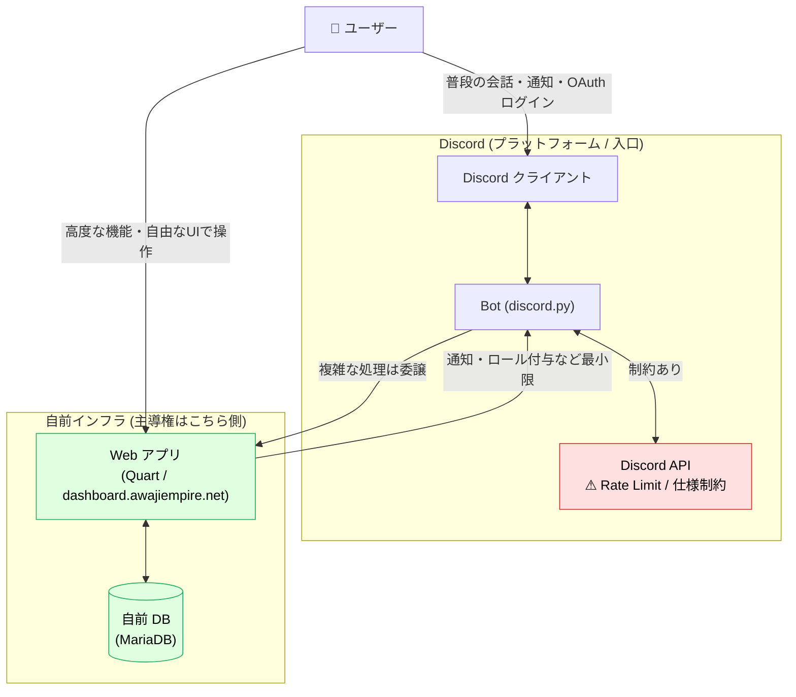

# 設計思想 — なぜ Web アプリにこだわるのか

## 1. この文書の目的

本プロジェクトは Discord Bot だけで完結させず、**Web アプリ (dashboard.awajiempire.net)** を中核に据えています。
その理由が暗黙知になっていたため、ここに明文化します。

結論を先に書くと **「自由度」と「主導権」** の確保です。

---

## 2. 背景 — Discord Bot 単体の限界

Discord Bot は手軽ですが、機能のすべてが **Discord 社の API とプラットフォーム仕様の上に乗っています**。
そのため、次のような構造的な制約を常に抱えます。

| 観点 | Discord Bot 単体 | Web アプリ |
| --- | --- | --- |
| **UI/UX** | Embed・ボタン・モーダル等、API が提供する部品の範囲内に限定 | HTML/CSS/JS で完全に自由に設計できる |
| **API 制限 (Rate Limit)** | 機能の実現可否が Discord のレートリミットに左右される | 自前サーバーで完結し、制限の影響を受けない |
| **データの保持・集計** | Discord の構造に依存 | 自前 DB (MariaDB) で任意に設計・集計できる |
| **仕様変更リスク** | Discord 側の仕様変更で機能が突然壊れうる | こちら側の都合でコントロールできる |
| **実現可能性** | 「API がサポートしていない＝実装不可能」 | 「やりようはある」＝設計次第で実装できる |

要点は、**何か機能を実装しようとしたときに Discord の API 制限に引っかかると、その時点で「不可能」になってしまう**こと。
一方、Web アプリであれば処理もデータも UI もすべてこちらの管理下にあるため、**制約は「不可能」ではなく「設計の問題」に変わります**。

---

## 3. Discord・Web アプリ・ユーザーの関係

Bot を「捨てる」のではなく、**Discord は入口 (ゲートウェイ)、Web アプリは本体 (頭脳)** という役割分担にしています。
Discord の手軽さ（通知・認証・コミュニティ）は活かしつつ、自由度が必要な処理は Web アプリ側へ逃がす構造です。

### 図の読み方

- **ユーザーには 2 つの入口がある**
  - 普段の会話・通知・OAuth ログインは **Discord** から（手軽さを利用）。
  - 高度な機能・自由な UI が必要な操作は **Web アプリ** から（自由度を利用）。
- **赤いノード (`Discord API`)** … Rate Limit と仕様変更という制約点。Bot 単体だとここがボトルネックになる。
- **緑のノード (`Web アプリ` / `自前 DB`)** … 制約のない領域。ここに処理を寄せることで「不可能」を「設計の問題」に置き換える。
- **Bot は薄く保つ** … Bot は「入口」と「Discord への最小限の出力（通知・ロール付与）」に徹し、ロジックの本体は Web アプリへ委譲する。

---

## 4. 設計上の指針

1. **判断に迷ったら Web アプリ側に寄せる。**
   Discord API に依存するほど、将来の制約・障害リスクを取り込むことになる。
2. **Bot は「Discord との境界」だけを担う。**
   ビジネスロジックを Bot に書き込みすぎない。あくまで入口とトリガー。
3. **自由度＝主導権。**
   こちらでコントロールできる領域を広く保つことが、長期的な機能拡張の余地を生む。

---

## 5. 関連ドキュメント

- [ARCHITECTURE.md](./ARCHITECTURE.md) — 物理〜アプリ層までのシステム全体構成
- [BOT_PERMISSION_REQUEST.md](./BOT_PERMISSION_REQUEST.md) — Bot に必要な Discord 権限の整理
