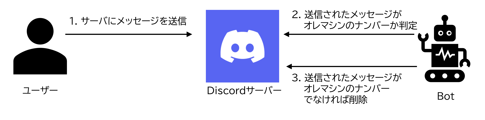

# 🛡️ メッセージフィルタリング機能

## 1. 概要
特定チャンネル (`config.CODE_CHANNEL_ID`) において、指定されたフォーマット（8桁の英数字コード）以外のメッセージを自動的に削除し、管理者にログを送信します。

## 2. 処理フロー
メッセージ受信から削除までの条件分岐を以下に示します。

## 3. 技術的詳細
- **判定ロジック**: 正規表現 `^[A-Za-z0-9]{8}$` を使用。
- **例外処理**: Bot自身のメッセージや、管理者による投稿を誤って削除しないようガードを設定。
- **権限要求**: 対象チャンネルにおける「メッセージの管理」権限が必須。
