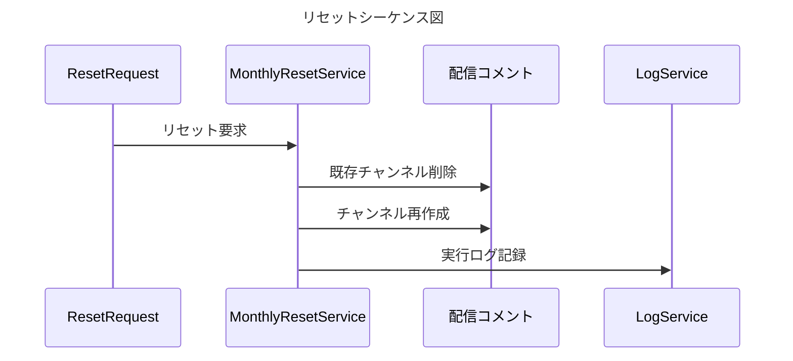

# 仕様書: #配信コメント チャンネル ツキイチリセット機能

- **ドキュメントID**: FEATURE_STREAM_COMMENT_RESET
- **バージョン**: 1.6.0
- **作成日**: 2026-03-18
- **更新日**: 2026-05-16
- **ステータス**: Implemented

---

## 1. 概要

Discord サーバー「淡路帝国」の `#配信コメント` チャンネルを、**毎月1回・配信終了直後**に自動でリセットする機能。

具体的には、Voice Keeper が**毎月20日**の配信終了後に寝落ち集計報告を `#配信コメント` へ投稿した直後にリセットを実行する。これにより配信中のリセットによる混乱を防ぐ。20日に配信がない・報告が失敗した場合は**翌21日 06:00 JST のフォールバック cron のみ**が補完する。21日を過ぎた場合はスラッシュコマンドによる手動実行のみ対応（毎月20日以外のリセットは想定しない）。

リセットはメッセージ削除ではなく **チャンネル自体の削除→再作成** で行い、チャンネル overwrite（閲覧・送信権限）を正規状態に戻す。

また、チャンネル設定が外部から変更された際に Bot 自身の権限が失われた場合、**Self Heal** によって即座に権限を自己修復する。

---

## 2. 要件

### 2.1 機能要件

| ID | 要件 |
|----|------|
| FR-01 | **毎月20日**に Voice Keeper の寝落ち集計報告を `#配信コメント` で検知した直後、`#配信コメント` チャンネルを削除し同名・同カテゴリ・同ポジションで再作成する（主トリガー） |
| FR-01b | 主トリガーが発火しなかった場合（20日に配信なし・報告失敗）のフォールバックとして、**毎月21日 06:00 JST のみ** 当月リセット済みかを確認し、未実施であれば実行する。21日を過ぎた場合はスラッシュコマンドによる手動リセットのみ対応 |
| FR-02 | 再作成時、規定の channel overwrite（閲覧・送信権限）を再設定する |
| FR-03 | リセット完了後、新チャンネルにリセット通知メッセージを投稿する |
| FR-04 | リセット実行ログを管理者向けチャンネルへ報告する |
| FR-05 | `/reset_stream_comments` スラッシュコマンドで即時リセットを実行できる。コマンド自体は `管理者` ロールを持つメンバーにのみ表示され、それ以外のユーザーのクライアントには存在しない。実行結果は Interaction への ephemeral 返信と `#bot-log` への報告の両方で通知する |
| FR-08 | **配信中フェールセーフ**: `TARGET_USER_ID` が VC に在席中（配信中）の場合、`/reset_stream_comments`（`dry_run=False`）の実行をブロックし ephemeral でエラーを返す。`dry_run=True` は配信中でも許可する |
| FR-06 | `on_guild_channel_update` イベントで `#配信コメント` の変更を検知し、Bot 自身の `manage_roles` 権限が channel overwrite から除去されていた場合、即座に自己再付与する（Self Heal） |
| FR-07 | Self Heal の発動履歴を管理者チャンネルへ通知し、DB に記録する |

### 2.2 非機能要件

| ID | 要件 |
|----|------|
| NFR-01 | チャンネル削除→再作成は Discord API の `guild.create_text_channel` を使用し、元のカテゴリ・ポジション・トピックを復元する |
| NFR-02 | API レート制限に対してリトライ処理（Exponential Backoff）を実装する |
| NFR-03 | リセット処理中に例外が発生した場合、処理を中断せず管理者チャンネルへエラー通知を行う |
| NFR-04 | 全実行ログ（月次リセット・Self Heal）は DB に保存する |
| NFR-05 | Self Heal は冪等に動作し、権限が既に正常な場合は何もしない |

---

## 3. アーキテクチャ

```
┌──────────────────────────────────────────────────────┐
│               discord_bot (Python)                   │
│                                                      │
│  ┌───────────────────────────────────────────────┐   │
│  │  Cog: VoiceKeeper                             │   │
│  │   寝落ち集計完了 → #配信コメント へ報告メッセージ投稿  │   │
│  └──────────────────────┬────────────────────────┘   │
│                         │ on_message                  │
│  ┌──────────────────────▼────────────────────────┐   │
│  │  Cog: StreamCommentReset                      │   │
│  │                                               │   │
│  │  ┌──────────────────────┐                     │   │
│  │  │  on_voice_keeper_end │ ← on_message        │   │
│  │  │  (主トリガー)         │   (VoiceKeeper報告) │   │
│  │  └──────────┬───────────┘                     │   │
│  │             │ 当月未リセットなら                │   │
│  │  ┌──────────▼───────────┐                     │   │
│  │  │  fallback_reset      │ ← tasks.loop(24h)   │   │
│  │  │  (フォールバック)      │   06:00 JST チェック│   │
│  │  └──────────┬───────────┘                     │   │
│  │             │ どちらも最終的に呼ぶ              │   │
│  │  ┌──────────▼───────────┐                     │   │
│  │  │  _execute_reset      │                     │   │
│  │  │  (削除→再作成)        │                     │   │
│  │  └──────────┬───────────┘                     │   │
│  │             │                                 │   │
│  │  ┌──────────▼───────────┐                     │   │
│  │  │  self_heal           │ ← on_guild_         │   │
│  │  │  (権限自己修復)       │   channel_update    │   │
│  │  └──────────┬───────────┘                     │   │
│  └─────────────┼───────────────────────────────  ┘   │
│                │ HTTP (REST)                          │
└────────────────┼─────────────────────────────────────┘
                 │
┌────────────────▼─────────────────────────────────────┐
│             database_bridge (Rust)                   │
│                                                      │
│  ┌──────────────────────────────────────────────┐    │
│  │  reset_log handler (sqlx + MariaDB)          │    │
│  └──────────────────────────────────────────────┘    │
└──────────────────────────────────────────────────────┘
```

### 3.1 Python 側の責務（`discord_bot`）

- スケジューラによる月次トリガー管理
- チャンネル削除→再作成・overwrite 再設定
- `on_guild_channel_update` による Self Heal 発動判定
- スラッシュコマンドの受付と権限チェック
- Rust 製 DB ブリッジへのログ記録リクエスト送信

### 3.2 Rust 側の責務（`database_bridge`）

- リセット・Self Heal ログの MariaDB への永続化
- 型安全な SQL 操作（`sqlx` によるコンパイル時検証）
- ログ取得エンドポイントの提供（管理ダッシュボード向け）

---

## 4. 実装詳細

### 4.1 ディレクトリ構成

> **Note**: プロジェクト方針「1機能1ディレクトリ」（`cogs/README.md` 参照）に準拠し、
> Interface (cog.py) / Logic (logic.py) / Service (services/) の3層に分離する。

```
discord_bot/
├── cogs/
│   └── stream_comment_reset/
│       ├── __init__.py              # パッケージ定義 + setup()
│       ├── cog.py                   # Interface: イベント・コマンド定義
│       └── logic.py                 # Business Logic: リセット判定・overwrite構築
└── services/
    └── stream_comment_reset_service.py  # I/O: チャンネル操作・通知送信・DB記録

database_bridge/
├── migrations/
│   └── 200_stream_comment_reset_log.sql  # テーブル作成マイグレーション
└── src/
    ├── db/
    │   ├── models.rs                # ResetLog モデル追加
    │   └── reset_log_repo.rs        # リポジトリ（insert / find）
    └── api/
        └── handlers/
            └── reset_log.rs         # ログ永続化ハンドラ
```

### 4.2 Python 実装仕様

**ファイル**: `discord_bot/cogs/stream_comment_reset/cog.py`（Interface）、`logic.py`（Logic）、`services/stream_comment_reset_service.py`（Service）

#### 定数・設定値

`config.py` または `.env` で管理する。

```python
STREAM_COMMENT_CHANNEL_NAME  = "配信コメント"   # 対象チャンネル名
ADMIN_REPORT_CHANNEL_NAME    = "bot-log"        # 管理者報告先チャンネル名
TARGET_USER_ID               = int(os.getenv("TARGET_USER_ID", "0"))  # 社畜天狗のユーザーID（VoiceKeeper と共通）
FALLBACK_HOUR_JST            = 6               # フォールバック cron の実行時刻（JST）

# Voice Keeper 報告メッセージを識別するキーワード
# cogs/voice_keeper/services.py の send 内容に合わせて調整すること
VOICE_KEEPER_REPORT_KEYWORD  = "寝落ち"        # このキーワードを含む Bot 自身のメッセージを主トリガーと判定

# 再作成時に設定する channel overwrite の定義
CHANNEL_OVERWRITES_SPEC = [
    {"target": "everyone", "allow": ["view_channel", "send_messages"], "deny": []},
    {"target": "bot",      "allow": ["view_channel", "send_messages",
                                     "manage_messages", "manage_roles"], "deny": []},
]
```

#### 環境変数の設定例（`.env`）

```bash
# #配信コメント チャンネル月次リセット機能
STREAM_COMMENT_CHANNEL_NAME=配信コメント
ADMIN_REPORT_CHANNEL_NAME=bot-log
FALLBACK_HOUR_JST=6
VOICE_KEEPER_REPORT_KEYWORD=寝落ち
ADMIN_ROLE_NAME=管理者
BOT_ROLE_NAME=Bot
```

| 環境変数 | 説明 | デフォルト | 変更可否 |
|---------|------|-----------|--------|
| `STREAM_COMMENT_CHANNEL_NAME` | リセット対象のテキストチャンネル名 | `配信コメント` | ○（別サーバー対応時） |
| `ADMIN_REPORT_CHANNEL_NAME` | リセット完了報告先チャンネル名 | `bot-log` | ○ |
| `FALLBACK_HOUR_JST` | フォールバック cron の実行時刻（JST） | `6` | ○（運用要件に合わせて） |
| `VOICE_KEEPER_REPORT_KEYWORD` | VoiceKeeper 報告メッセージの検索キーワード | `寝落ち` | △（voice_keeper の仕様に依存） |
| `ADMIN_ROLE_NAME` | スラッシュコマンド実行権限をもつロール名 | `管理者` | ○ |
| `BOT_ROLE_NAME` | Bot に付与する overwrite 権限対象のロール名 | `Bot` | ○（環境に応じて） |

#### 主トリガー：Voice Keeper 報告検知

```python
from discord.ext import tasks, commands
import discord
from datetime import datetime, timezone, timedelta

JST = timezone(timedelta(hours=9))

class StreamCommentReset(commands.Cog):
    def __init__(self, bot: commands.Bot):
        self.bot = bot
        self._last_reset_month: int | None = None  # 当月リセット済みかを記録
        self.fallback_reset.start()

    @commands.Cog.listener()
    async def on_message(self, message: discord.Message):
        """Voice Keeper が寝落ち集計報告を投稿したら月次リセットを実行する（主トリガー）"""
        # Bot 自身のメッセージかつ対象チャンネル以外は無視
        if not message.author.bot:
            return
        if message.channel.name != STREAM_COMMENT_CHANNEL_NAME:
            return
        if VOICE_KEEPER_REPORT_KEYWORD not in (message.content or ""):
            return

        await self._try_monthly_reset(triggered_by="voice_keeper")

    async def _try_monthly_reset(self, triggered_by: str):
        """当月未リセットであればリセットを実行する"""
        now = datetime.now(JST)
        if self._last_reset_month == now.month:
            return  # 今月は既にリセット済み
        await self._execute_reset(triggered_by=triggered_by)
        self._last_reset_month = now.month
```

#### フォールバック cron（20日に配信がなかった場合のみ・毎月21日限定）

```python
    @tasks.loop(hours=24)
    async def fallback_reset(self):
        """20日に VoiceKeeper 報告がなかった場合のみ、21日 06:00 JST に補完する。
        毎月20日以外ではリセットを想定しないため、day==21 の条件で厳密に制限する。
        """
        now = datetime.now(JST)
        if now.day != 21 or now.hour != FALLBACK_HOUR_JST:
            return  # 毎月21日 06:00 JST 以外は何もしない
        await self._try_monthly_reset(triggered_by="fallback_scheduler")
```

> **Note**: 21日を過ぎてリセットが実行されなかった場合は、
> スラッシュコマンド `/reset_stream_comments` による手動実行のみ対応。
> `_last_reset_month` はメモリ上の値のため、Bot 再起動時にリセットされる。
> DB の `stream_comment_reset_log` を参照して当月実行済みかを判定する実装に切り替えることを推奨する。

#### チャンネル削除→再作成ロジック

```python
async def _execute_reset(self, triggered_by: str):
    guild = self.bot.get_guild(DISCORD_GUILD_ID)
    channel = discord.utils.get(guild.text_channels, name=STREAM_COMMENT_CHANNEL_NAME)

    if channel is None:
        await self._report_error("対象チャンネルが見つかりません", triggered_by)
        return

    # 元の位置情報を退避
    category  = channel.category
    position  = channel.position
    topic     = channel.topic

    try:
        await channel.delete(reason="月次リセット by Awaji Empire Agent")
    except discord.Forbidden:
        await self._report_error("チャンネル削除権限がありません", triggered_by)
        return

    # overwrite を構築
    overwrites = self._build_overwrites(guild)

    new_channel = await guild.create_text_channel(
        name      = STREAM_COMMENT_CHANNEL_NAME,
        category  = category,
        position  = position,
        topic     = topic,
        overwrites= overwrites,
        reason    = "月次リセット by Awaji Empire Agent",
    )

    await new_channel.send(
        "🔄 **チャンネルリセット完了**\n"
        "毎月恒例のリセットを実施しました。今月もコメントよろしくお願いします！"
    )

    await self._report_success(triggered_by)
    await self._log_to_db(triggered_by, status="success")
```

#### overwrite 構築ヘルパー

```python
def _build_overwrites(self, guild: discord.Guild) -> dict:
    """CHANNEL_OVERWRITES_SPEC を discord.PermissionOverwrite に変換して返す"""
    overwrites = {}
    for spec in CHANNEL_OVERWRITES_SPEC:
        target_key = spec["target"]

        if target_key == "everyone":
            target = guild.default_role
        else:
            role_name = target_key.split("role:")[1]
            target = discord.utils.get(guild.roles, name=role_name)
            if target is None:
                continue  # ロールが存在しない場合はスキップ

        allow_perms = {p: True  for p in spec["allow"]}
        deny_perms  = {p: False for p in spec["deny"]}
        overwrites[target] = discord.PermissionOverwrite(**{**allow_perms, **deny_perms})

    return overwrites
```

#### Self Heal

```python
@commands.Cog.listener()
async def on_guild_channel_update(
    self,
    before: discord.abc.GuildChannel,
    after: discord.abc.GuildChannel,
):
    # 対象チャンネル以外は無視
    if after.name != STREAM_COMMENT_CHANNEL_NAME:
        return

    bot_member = after.guild.me
    overwrite  = after.overwrites_for(bot_member)

    # manage_roles が True でなければ Self Heal 発動
    if overwrite.manage_roles is not True:
        try:
            await after.set_permissions(
                bot_member,
                manage_roles    = True,
                manage_messages = True,
                view_channel    = True,
                send_messages   = True,
                reason          = "Self Heal: Bot 権限の自動復元",
            )
            await self._report_self_heal(after, before_overwrite=overwrite)
            await self._log_to_db("self_heal", status="success", channel=after.name)

        except discord.Forbidden:
            await self._report_error(
                "Self Heal 失敗: Bot に manage_roles 権限がありません",
                triggered_by="self_heal",
            )
```

> **Note**: `manage_roles` は channel overwrite の「権限の管理（チャンネル単位）」に対応する。サーバーレベルの `manage_roles` とは別物であることに注意。

#### スラッシュコマンド

**コマンド仕様**

| 項目 | 値 |
|------|----|
| コマンド名 | `/reset_stream_comments` |
| 説明 | 【管理者専用】`#配信コメント` チャンネルを即時リセットします |
| 可視性制御 | `default_member_permissions=Permissions(0)` を設定し、**Discord クライアント上でコマンド自体を非表示**にする。サーバーの「アプリの統合」設定で `管理者` ロールのみ使用許可に上書きする |
| ランタイム権限チェック | `@app_commands.checks.has_role("管理者")` によるロールチェックを二重で実施（Discord 側設定の迂回を防止） |
| レスポンス | ephemeral（実行者のみ表示） |
| オプション | `dry_run: bool`（デフォルト: `False`）— `True` の場合、削除・再作成を行わずに対象チャンネルと overwrite 情報をプレビュー表示する |

> **仕組みの補足**
> Discord の `default_member_permissions=Permissions(0)` を設定すると、
> 「いかなる権限も持たないユーザー（= 全員）にデフォルトで非表示」という扱いになる。
> その後サーバー管理者がサーバー設定 → アプリの統合 → コマンドごとの権限で
> `管理者` ロールを「許可」に設定すると、そのロールを持つメンバーのみがコマンドを視認・実行できる。
> ランタイムの `has_role` チェックは、Bot 招待先の設定変更に対する保険として維持する。

```python
ADMIN_ROLE_NAME = "管理者"

@discord.app_commands.command(
    name="reset_stream_comments",
    description="【管理者専用】#配信コメント チャンネルを即時リセットします",
)
@discord.app_commands.describe(dry_run="True にするとプレビューのみ（実際には削除しない）")
# default_permissions() = Permissions(0) でコマンド自体を全員非表示にし、
# サーバー側のアプリ統合設定で 管理者 ロールのみ表示・実行を許可する。
@discord.app_commands.default_permissions()   # = Permissions(0)
@discord.app_commands.checks.has_role(ADMIN_ROLE_NAME)
async def reset_stream_comments(
    self,
    interaction: discord.Interaction,
    dry_run: bool = False,
):
    await interaction.response.defer(ephemeral=True)

    if dry_run:
        guild   = self.bot.get_guild(DISCORD_GUILD_ID)
        channel = discord.utils.get(guild.text_channels, name=STREAM_COMMENT_CHANNEL_NAME)
        if channel is None:
            await interaction.followup.send("❌ 対象チャンネルが見つかりません。", ephemeral=True)
            return
        overwrites = self._build_overwrites(guild)
        preview = "\n".join(
            f"- {target.name}: allow={ow.pair()[0].value}, deny={ow.pair()[1].value}"
            for target, ow in overwrites.items()
        )
        await interaction.followup.send(
            f"🔍 **[Dry Run] リセットプレビュー**\n"
            f"対象チャンネル: #{channel.name}\n"
            f"カテゴリ: {channel.category}\n"
            f"**設定予定の overwrite:**\n{preview}",
            ephemeral=True,
        )
        return

    await self._execute_reset(triggered_by=str(interaction.user))
    await interaction.followup.send("✅ リセットを実行しました。`#bot-log` を確認してください。", ephemeral=True)


@reset_stream_comments.error
async def reset_stream_comments_error(
    self,
    interaction: discord.Interaction,
    error: discord.app_commands.AppCommandError,
):
    if isinstance(error, discord.app_commands.MissingRole):
        await interaction.response.send_message(
            f"❌ このコマンドは `{ADMIN_ROLE_NAME}` ロールのみ実行できます。",
            ephemeral=True,
        )
    else:
        await interaction.response.send_message(
            f"❌ 予期しないエラーが発生しました: `{error}`",
            ephemeral=True,
        )
```

**Discord サーバー側の設定手順（初回デプロイ時に実施）**

1. サーバー設定 → アプリの統合 → Bot 名を選択
2. `/reset_stream_comments` → 「権限を追加」→ ロール `管理者` を「許可」に設定
3. `管理者` ロールを持たないアカウントでコマンドが非表示になっていることを確認

---

### 4.3 Rust 実装仕様

**ファイル**: `database_bridge/src/handlers/reset_log.rs`

#### DB テーブル定義

```sql
CREATE TABLE stream_comment_reset_log (
    id            BIGINT UNSIGNED AUTO_INCREMENT PRIMARY KEY,
    executed_at   DATETIME        NOT NULL DEFAULT CURRENT_TIMESTAMP,
    triggered_by  VARCHAR(64)     NOT NULL COMMENT 'scheduler | self_heal | user_id',
    event_type    ENUM('monthly_reset', 'self_heal', 'manual_reset') NOT NULL,
    status        ENUM('success', 'partial', 'failed') NOT NULL,
    error_message TEXT            NULL,
    INDEX idx_executed_at (executed_at),
    INDEX idx_event_type  (event_type)
) ENGINE=InnoDB DEFAULT CHARSET=utf8mb4;
```

#### Rust ハンドラ

```rust
use sqlx::MySqlPool;
use serde::Deserialize;

#[derive(Deserialize, sqlx::Type, Debug)]
#[sqlx(rename_all = "snake_case")]
pub enum EventType {
    MonthlyReset,
    SelfHeal,
    ManualReset,
}

#[derive(Deserialize, sqlx::Type, Debug)]
#[sqlx(rename_all = "snake_case")]
pub enum ResetStatus {
    Success,
    Partial,
    Failed,
}

#[derive(Deserialize)]
pub struct ResetLogRequest {
    pub triggered_by:  String,
    pub event_type:    EventType,
    pub status:        ResetStatus,
    pub error_message: Option<String>,
}

pub async fn insert_reset_log(
    pool: &MySqlPool,
    req: ResetLogRequest,
) -> Result<u64, sqlx::Error> {
    let result = sqlx::query!(
        r#"
        INSERT INTO stream_comment_reset_log
            (triggered_by, event_type, status, error_message)
        VALUES (?, ?, ?, ?)
        "#,
        req.triggered_by,
        req.event_type    as EventType,
        req.status        as ResetStatus,
        req.error_message,
    )
    .execute(pool)
    .await?;

    Ok(result.last_insert_id())
}
```

---

## 5. 処理フロー



### 5.1 月次リセット（主トリガー：Voice Keeper 報告検知）

```
[Voice Keeper が #配信コメント に寝落ち集計報告を投稿]
          │  on_message
          ▼
  メッセージが Bot 自身の投稿か？
  かつ VOICE_KEEPER_REPORT_KEYWORD を含むか？
       No  → 無視
       Yes ↓
          ▼
  _try_monthly_reset("voice_keeper") 呼び出し
          │
          ▼
  当月リセット済みか？（_last_reset_month チェック）
       Yes → 何もしない（冪等）
       No  ↓
          ▼
  _execute_reset() → 共通リセットロジックへ ─────────────┐
                                                         │
[フォールバック cron: 毎月21日 06:00 JST 限定]            │
          │  tasks.loop(hours=24)                        │
          ▼                                              │
  now.day == 21 かつ now.hour == 06 か？                 │
       No  → 無視（毎月20日以外はリセット対象外）          │
       Yes ↓                                             │
          ▼                                              │
  _try_monthly_reset("fallback_scheduler") 呼び出し       │
          │                                              │
          ▼                                              │
  当月リセット済みか？                                     │
       Yes → 何もしない                                   │
       No  ↓                                             │
          ▼                                              │
  _execute_reset() ────────────────────────────────────  ┘
          │
          ▼  ＜共通リセットロジック＞
  #配信コメント チャンネル取得
  カテゴリ・ポジション・トピックを退避
          │
          ▼
  チャンネルを削除
          │
          ▼
  CHANNEL_OVERWRITES_SPEC を元に overwrite を構築
          │
          ▼
  同名・同カテゴリ・同ポジションでチャンネルを再作成
          │
          ▼
  リセット通知メッセージを投稿
          │
          ▼
  管理者チャンネルに実行サマリを報告
  （triggered_by = "voice_keeper" or "fallback_scheduler"）
          │
          ▼
  DB ブリッジ (Rust) にログ記録
          │
          ▼
       完了
```

### 5.2 Self Heal

```
[on_guild_channel_update 発火]
          │
          ▼
  変更チャンネルが #配信コメント か？
       No → 無視
       Yes ↓
          ▼
  Bot の channel overwrite を確認
  manage_roles == True か？
       Yes → 何もしない（冪等）
       No  ↓
          ▼
  set_permissions() で
  Bot の overwrite を再設定
          │
          ▼
  管理者チャンネルに Self Heal 通知
          │
          ▼
  DB ブリッジ (Rust) にログ記録
          │
          ▼
       完了
```

### 5.3 手動リセット（スラッシュコマンド）

```
[/reset_stream_comments 実行]
          │
          ▼
  dry_run == False かつ　`管理者`がVCに在籍している。 = 配信中
       Yes → コメントリセット中止
              エラー ephemeral を返信して終了
       No  ↓
          │
          ▼
  dry_run == True か？
       Yes → 対象チャンネル・overwrite プレビューを
             ephemeral で返信して終了
       No  ↓
          ▼
  実行者の `管理者` ロールチェック
  ロールなし → エラー ephemeral を返信して終了
  ロールあり ↓
          ▼
  interaction.response.defer(ephemeral=True)
          │
          ▼
  _execute_reset(triggered_by="<User#1234>")
  （月次リセットと同一ロジックを再利用）
          │
          ▼
  実行者へ完了 ephemeral を返信
          │
          ▼
  管理者チャンネルに手動リセット報告
  （triggered_by = 実行者 Discord ID）
          │
          ▼
  DB ブリッジ (Rust) に
  event_type=manual_reset でログ記録
          │
          ▼
       完了
```

---

## 6. 通知メッセージ仕様

### 6.1 チャンネル内通知（`#配信コメント`）

```
🔄 チャンネルリセット完了
毎月恒例のリセットを実施しました。
今月もコメントよろしくお願いします！
```

### 6.2 管理者チャンネル：月次リセット報告（`#bot-log`）

**Voice Keeper 報告後に自動実行された場合:**

```
[StreamCommentReset] ✅ 月次リセット完了
- 実行日時 : 2026-04-20 02:15:44 JST
- トリガー : voice_keeper（VoiceKeeper 寝落ち集計報告を検知）
- 処理内容 : チャンネル削除 → 再作成 + overwrite 再設定
```

**フォールバック cron により実行された場合:**

```
[StreamCommentReset] ✅ 月次リセット完了
- 実行日時 : 2026-04-21 06:00:05 JST
- トリガー : fallback_scheduler（配信なし or 主トリガー未発火のため補完）
- 処理内容 : チャンネル削除 → 再作成 + overwrite 再設定
```

### 6.3 管理者チャンネル：Self Heal 報告（`#bot-log`）

```
[StreamCommentReset] ⚠️ Self Heal 発動
- 検知日時 : 2026-04-05 14:22:11 JST
- 対象     : #配信コメント
- 原因     : Bot の manage_roles overwrite が除去されていました
- 対応     : channel overwrite を自動再設定しました
```

### 6.4 管理者チャンネル：手動リセット報告（`#bot-log`）

```
[StreamCommentReset] ✅ 手動リセット完了
- 実行日時 : 2026-04-05 14:30:22 JST
- トリガー : SubGo#0001（Discord ユーザー ID）
- 処理内容 : チャンネル削除 → 再作成 + overwrite 再設定
```

### 6.5 実行者への ephemeral 返信

**正常完了時:**

```
✅ リセットを実行しました。`#bot-log` を確認してください。
```

**Dry Run 時:**

```
🔍 [Dry Run] リセットプレビュー
対象チャンネル: #配信コメント
カテゴリ: 配信
設定予定の overwrite:
- @everyone: allow=view_channel, deny=send_messages
- 配信者: allow=view_channel|send_messages, deny=（なし）
- Bot: allow=view_channel|send_messages|manage_messages|manage_roles, deny=（なし）
```

**権限エラー時:**

```
❌ このコマンドは `管理者` ロールのみ実行できます。
```

---

## 7. エラーハンドリング

| シナリオ | 対応 |
|----------|------|
| 対象チャンネルが見つからない | 管理者チャンネルにエラー通知、DB に `failed` ログ記録 |
| チャンネル削除に `Forbidden` | 管理者チャンネルにエラー通知、DB に `failed` ログ記録 |
| チャンネル再作成に `Forbidden` | 管理者チャンネルにエラー通知、DB に `failed` ログ記録 |
| overwrite 設定対象ロールが存在しない | そのロールをスキップし処理継続、管理者チャンネルに警告 |
| Discord API レート制限 (429) | Exponential Backoff でリトライ（最大5回） |
| Self Heal 時に `Forbidden` | 管理者チャンネルにエラー通知（Bot 自身のサーバー権限を要確認） |
| DB ブリッジへの接続失敗 | リセット処理自体は継続、管理者チャンネルに警告通知 |

---

## 8. テスト方針

### 8.1 Python

- `pytest` + `discord.py` のモックを使用
- `_build_overwrites` のロール名解決・存在しないロールのスキップテスト
- チャンネル削除→再作成の正常系・Forbidden 系テスト
- `on_guild_channel_update` の Self Heal 発動条件テスト（manage_roles あり／なし）
- Self Heal の冪等性テスト（権限が正常な場合は何もしないこと）

**Voice Keeper 連携トリガーテスト**

| テストケース | 確認内容 |
|-------------|---------|
| 正常系：Voice Keeper 報告検知 | `VOICE_KEEPER_REPORT_KEYWORD` を含む Bot メッセージで `_try_monthly_reset("voice_keeper")` が呼ばれること |
| 当月リセット済みの場合 | `_last_reset_month == now.month` のとき `_execute_reset` が呼ばれないこと（冪等性） |
| 別チャンネルへの投稿 | 対象チャンネル以外への Bot メッセージはトリガーされないこと |
| Bot 以外のメッセージ | 人間ユーザーのメッセージはトリガーされないこと |
| キーワード不一致 | `VOICE_KEEPER_REPORT_KEYWORD` を含まない Bot メッセージはトリガーされないこと |
| フォールバック cron：21日 06:00 かつ未リセット | `day==21, hour==6` のとき `_try_monthly_reset("fallback_scheduler")` が呼ばれること |
| フォールバック cron：21日以外 | `day != 21` の場合は何もしないこと（毎月20日以外はリセット対象外） |
| フォールバック cron：21日だが時刻不一致 | `day==21` でも `hour != 6` の場合は実行されないこと |
| フォールバック cron：21日かつリセット済み | 20日に VoiceKeeper 報告でリセット済みの場合、21日 06:00 のフォールバックは何もしないこと |
| Bot 再起動後の冪等性 | 再起動後でも DB の当月ログを参照して二重リセットされないこと（推奨実装時） |

**スラッシュコマンド追加テスト**

| テストケース | 確認内容 |
|-------------|---------|
| 正常系：`dry_run=False` | `_execute_reset` が `triggered_by=<実行者>` で呼ばれること、ephemeral 返信が送られること |
| 正常系：`dry_run=True` | `_execute_reset` が呼ばれないこと、プレビューテキストが ephemeral で返信されること |
| 権限不足（ロールなし） | `MissingRole` エラー時に「`管理者` ロールのみ実行できます」メッセージが返されること |
| コマンド非表示 | `管理者` ロールを持たないユーザーのクライアントでコマンドがオートコンプリートに表示されないこと |
| 対象チャンネル不在（dry_run=True） | チャンネルが存在しない旨の ephemeral が返されること |
| DB ブリッジ障害 | DB 書き込み失敗時もリセット処理が完了し、管理者チャンネルに警告が送られること |
| `triggered_by` の記録 | DB ログの `event_type` が `manual_reset`、`triggered_by` が実行者の Discord ID になること |

### 8.2 Rust

- `sqlx::test` マクロによる DB 統合テスト
- `EventType` / `ResetStatus` のデシリアライズテスト
- `insert_reset_log` の正常系・異常系テスト（monthly_reset / self_heal / manual_reset 各 event_type）

---

## 9. 設定一覧

| キー | 型 | デフォルト | 説明 |
|------|----|------------|------|
| `STREAM_COMMENT_CHANNEL_NAME` | `str` | `"配信コメント"` | リセット対象チャンネル名 |
| `ADMIN_REPORT_CHANNEL_NAME` | `str` | `"bot-log"` | 管理者報告チャンネル名 |
| `TARGET_USER_ID` | `int` | `0`（無効） | 社畜天狗のユーザーID（VoiceKeeper と共通） |
| `FALLBACK_HOUR_JST` | `int` | `6` | フォールバック cron の実行時刻（JST）。毎月21日のみ有効 |
| `VOICE_KEEPER_REPORT_KEYWORD` | `str` | `"寝落ち"` | VoiceKeeper 報告メッセージの識別キーワード |
| `CHANNEL_OVERWRITES_SPEC` | `list` | （上記参照） | 再作成時に設定する overwrite の定義 |

---

## 10. 関連ドキュメント

- [ARCHITECTURE.md](./ARCHITECTURE.md)
- [FEATURE_MASS_MUTE.md](./FEATURE_MASS_MUTE.md)
- [CHANGELOG.md](../CHANGELOG.md)
