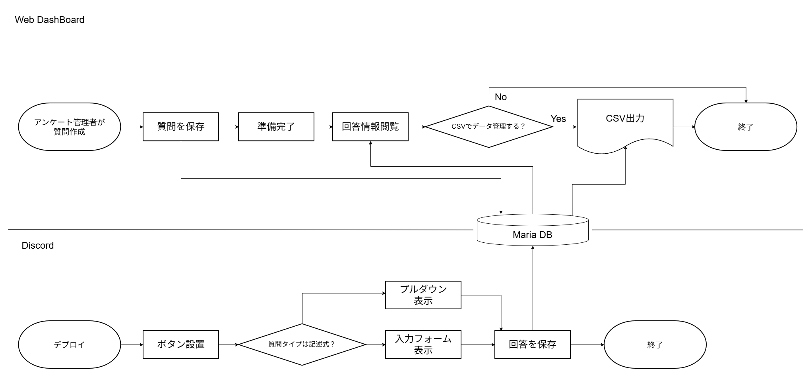

# 📝 内製アンケートシステム (Survey System)

## 1. 概要
外部サービスに依存せず、Web管理画面での作成からDiscordでの対話型回答までを一気通貫で管理する独自開発のフォームシステムです。

## 2. 統合フローチャート
Web Dashboard (Quart) と Discord Bot (discord.py) が MariaDB を介してどう連携するかを示します。

## 3. 各層の役割
### Web Dashboard
- **作成・編集**: 質問タイプ（記述/単一選択/複数選択）をJSON形式で構築しDBへ保存。
- **データ出力**: 回答結果を MariaDB から取得し、CSVファイルとしてエクスポート。

### Discord Bot
- **デプロイ**: 保存されたIDを指定して、回答用ボタンをチャンネルに設置。
- **対話型UI**: ボタン押下後、Modal（入力フォーム）や Select Menu（プルダウン）を順次表示する独自のウィザード形式を採用。

### Database (MariaDB)
- **surveysテーブル**: 質問定義（JSON）の保存。
- **survey_responsesテーブル**: ユーザーID、回答内容（JSON）、日時の保存。
