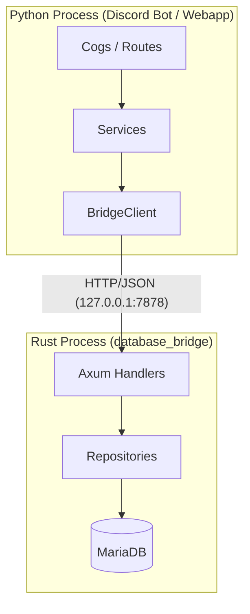

# ADR-003: Python ↔ Rust 通信方式に HTTP-based IPC を採用

- **日付**: 2026-02-23
- **ステータス**: 承認済み (実装完了)
- **ブランチ**: `feature/phase3-rust-bridge`
- **関連仕様書**: [phase3b-python-rust-bridge.md](../Specifications/phase3b-python-rust-bridge.md)

---

## 1. 背景

Phase 3-A で Rust 側の DB 共通基盤（`database_bridge`）を構築した。Phase 3-B では、Python プロセス（Discord Bot / Webapp）と Rust プロセスの間で通信を行い、Rust 側に DB 操作を完全に委譲するためのブリッジ方式を決定する必要がある。

## 2. 検討した選択肢

仕様書 [phase3b-python-rust-bridge.md](../Specifications/phase3b-python-rust-bridge.md) に基づき、以下の 3 つを比較した。

1. **候補 A: PyO3 (FFI)**
   - Rust を Python 拡張モジュールとしてビルドし、直接関数を呼び出す方式。
   - **理由**: 同一プロセスで動作するが、`asyncio` (Python) と `tokio` (Rust) のランタイム衝突の解決が複雑。

2. **候補 B: HTTP IPC (Loopback)**
   - Rust を独立したプロセスとし、`axum` で HTTP サーバーを立て、Python から `httpx` で呼び出す方式。
   - **理由**: ランタイムが完全に分離され安全。既存の `httpx` エコシステムを活用できる。

3. **候補 C: gRPC**
   - Protocol Buffers を使用した通信。
   - **理由**: 本プロジェクトのスケール（単一ホスト内通信）に対しては定義・生成コストが過剰（オーバーエンジニアリング）。

## 3. 決定事項

**候補 B: HTTP-based IPC (Loopback / TCP)** を採用した。

具体的な構成:

- **Rust 側**: `axum` フレームワークを使用し、JSON API エンドポイントを実装。
- **Python 側**: `httpx` (AsyncClient) を使用した `bridge_client.py` を実装し、サービス層を shim 化。
- **プロセス管理**: `systemd` を使用して Rust Bridge プロセスを独立して管理。

## 4. 採用理由

1. **ランタイムの完全分離**:
   - `discord.py` (`asyncio`) と `sqlx` (`tokio`) のランタイムが別プロセスとなるため、競合やデッドロックのリスクが皆無。
2. **実装のシンプルさ**:
   - Python 側は既存の HTTP クライアントライブラリを使うだけで済み、特殊な FFI バインディングや .proto 管理が不要。
3. **プロセスの安全性**:
   - Rust 側で致命的なエラーが発生しても Python 側（Bot 起動）が道連れにならず、独立して再起動可能。
4. **デプロイの柔軟性**:
   - `systemd` オートメーションにより、Rust 側のアップデート時にバイナリを差し替えて再起動するフローが確立しやすい。

## 5. 変更後のアーキテクチャ

## 6. 結果と影響

- **DB ドライバの集約**: Python 側から `aiomysql` / `mysql.connector` への依存を完全に排除できた。
- **型安全性の向上**: Rust 側で `sqlx` によるコンパイル時クエリ検証と構造体マッピングが行われるようになった。
- **コネクション管理の効率化**: Rust プロセスが単一の接続プール（`sqlx::MySqlPool`）を管理するため、接続数の予測可能性が向上した。
- **オーバーヘッド**: ローカルネットワーク RTT (約 0.5~1.0ms) が追加されたが、DB 操作全体のレイテンシと比較して無視できる範囲であることを確認した。
